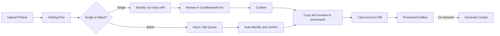
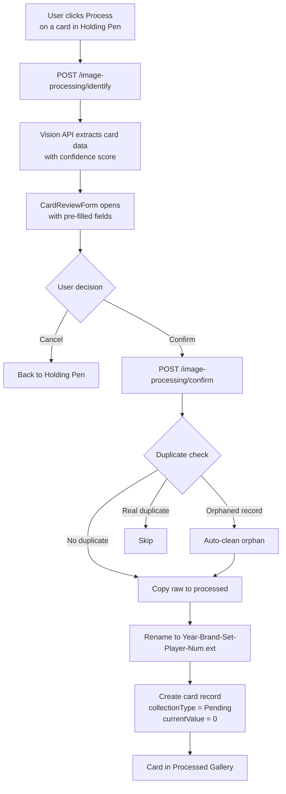
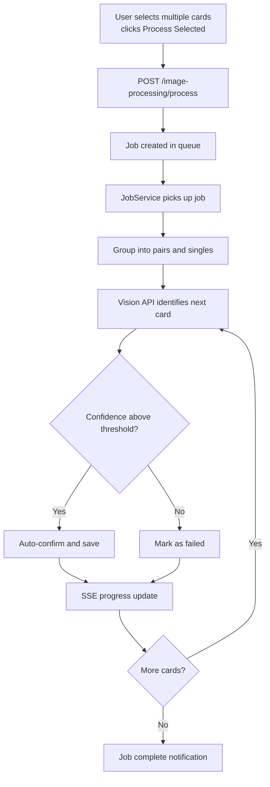
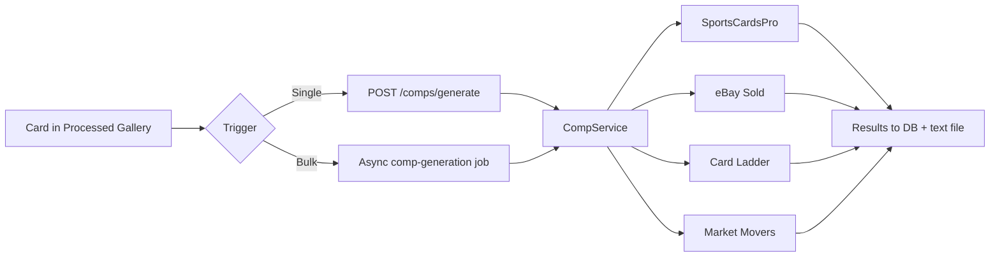

# Ingestion Pipeline Workflow

## Overview

The ingestion pipeline takes raw card photos and produces cataloged card records in the database with renamed images in the `processed/` directory. Comp generation is a separate, user-initiated step that happens after ingestion.

## High-Level Pipeline

## Single Card Flow

## Batch Flow

## Comp Generation (Separate Step)

## Step-by-Step Details

### 1. Upload

Photos are added to the system in one of two ways:

- **UI upload**: Drag-and-drop or click in the Holding Pen. Supports jpg, jpeg, png, gif, webp, bmp, tiff. Calls `POST /files/raw/upload` (multipart).
- **Direct placement**: Files placed directly in the `raw/` directory are picked up on next Holding Pen load.

### 2. Holding Pen

The Holding Pen (`src/components/HoldingPen/HoldingPen.tsx`) lists all files in `raw/`, sorted by modification time (newest first).

**Front/back pairing**: Files with `-front` and `-back` suffixes sharing the same base name are auto-grouped into pairs. Both images are sent to the Vision API together for better identification accuracy.

**Available actions per card**:
- **Process** (single) -- starts the identify/review/confirm flow
- **View** -- lightbox preview
- **Crop** -- edit image before processing
- **Delete** -- remove from raw/

**Bulk actions**:
- **Select All** -- checkbox toggle
- **Process Selected** -- batch process via async job
- **Delete Selected** -- bulk remove

### 3a. Single Card -- Identify

Triggered when the user clicks "Process" on one card.

| | |
|---|---|
| **Endpoint** | `POST /image-processing/identify` |
| **Payload** | `{ filename, backFile? }` |
| **Service** | `imageProcessingService.identifyOnly()` |
| **Vision API** | `anthropicVisionService.identifyCard()` or `identifyCardPair()` |
| **Model** | `claude-sonnet-4-20250514`, max 1024 tokens, 4 retries |

Returns `ExtractedCardData` containing:
- Card fields: player, year, brand, setName, cardNumber, team, category, parallel, serialNumber
- Grading: gradingCompany, grade, condition
- Features: isRookie, isAutograph, isRelic, isNumbered, isGraded, isParallel
- Confidence: score (0-100), level (high/medium/low), detectedFields count, missingFields list
- rawText from the card

**This step is read-only.** Nothing is saved, copied, or created.

### 3b. Single Card -- Review & Confirm

The **CardReviewForm** (`src/components/CardReviewForm/CardReviewForm.tsx`) opens as a modal with vision results pre-filled.

**Editable fields**: Player Name, Year, Brand, Set Name, Card Number, Team, Category, Parallel, Serial Number, Grading Company, Grade, Condition, plus feature checkboxes (Rookie, Autograph, Relic, Numbered).

On "Confirm & Process", calls `POST /image-processing/confirm` with the user-edited data.

### 3c. Batch Processing (Alternative Path)

Triggered when the user selects multiple cards and clicks "Process Selected".

| | |
|---|---|
| **Endpoint** | `POST /image-processing/process` |
| **Payload** | `{ filenames, skipExisting?, confidenceThreshold? }` |
| **Execution** | Creates an `image-processing` job in the job queue |

The JobService polls for pending jobs (configurable interval, default 5s). When it picks up the job:

1. Groups files into front/back pairs and standalone images
2. For each: calls Vision API, checks confidence against threshold
3. Above threshold: auto-confirms (no user review)
4. Below threshold: marked as failed
5. Progress broadcast to frontend via SSE (`eventService`)
6. Frontend refreshes file list on job completion

### 4. On Confirm (Both Paths)

Whether from single-card confirm or batch auto-confirm, the same processing occurs:

1. **Idempotency check**: Skip if already processed
2. **Duplicate detection**: Checks for existing card with same player + year + brand + cardNumber
   - If found with missing files on disk (orphan): auto-delete the orphan, proceed
   - If real duplicate: skip / mark as duplicate
3. **File copy & rename**: Image copied from `raw/` to `processed/`
   - Format: `{Year}-{Brand}-{SetName}-{Player}-{CardNumber}.ext` (set omitted if not detected, spaces replaced with dashes)
   - Pairs: `-front` and `-back` suffixes appended
4. **Card record created** in the database:
   - All vision-extracted (or user-edited) fields populated
   - `collectionType: 'Pending'`
   - `currentValue: 0`
   - `images[]` array contains the processed filename(s)
5. **Processing failures** logged to database audit logs

### 5. Comp Generation (Separate, On-Demand)

Comps are **not part of the ingestion pipeline**. After cards appear in the Processed Gallery, the user can trigger comp generation:

- **Single card**: Click "Generate Comps" -- calls `POST /comps/generate`
- **Bulk**: Select multiple cards, generate -- creates a `comp-generation` async job with SSE progress

Comp results are stored in the database and written as text files in `processed/` (e.g., `2023-Topps-Chrome-Mike-Trout-1-comps.txt`).

## Key Files

| File | Role |
|------|------|
| `src/components/HoldingPen/HoldingPen.tsx` | Holding Pen UI |
| `src/components/CardReviewForm/CardReviewForm.tsx` | Review/edit modal |
| `src/components/ProcessedGallery/ProcessedGallery.tsx` | Processed card gallery + comp trigger |
| `src/services/api.ts` | Frontend API client (all ingestion methods) |
| `server/src/routes/imageProcessing.ts` | Identify, confirm, batch endpoints |
| `server/src/services/imageProcessingService.ts` | Pipeline orchestration |
| `server/src/services/anthropicVisionService.ts` | Claude Vision API integration |
| `server/src/services/fileService.ts` | Filesystem operations (raw/processed) |
| `server/src/services/jobService.ts` | Async job queue with polling |
| `server/src/services/eventService.ts` | SSE for real-time progress |
| `server/src/services/compService.ts` | Comp data fetching and aggregation |

## API Endpoints

| Method | Endpoint | Purpose |
|--------|----------|---------|
| `POST` | `/files/raw/upload` | Upload raw photos |
| `GET` | `/files/raw` | List raw files |
| `DELETE` | `/files/raw/:filename` | Delete a raw file |
| `PUT` | `/files/raw/:filename` | Replace a raw file (crop) |
| `POST` | `/image-processing/identify` | Vision-only identification (no commit) |
| `POST` | `/image-processing/confirm` | Commit reviewed card data |
| `POST` | `/image-processing/process` | Create async batch processing job |
| `POST` | `/image-processing/process-sync` | Process single image synchronously |
| `GET` | `/image-processing/status` | Raw/processed counts + recent errors |
| `POST` | `/comps/generate` | Generate comps for a single card |
| `POST` | `/comps/generate-and-save` | Generate and persist comps |
